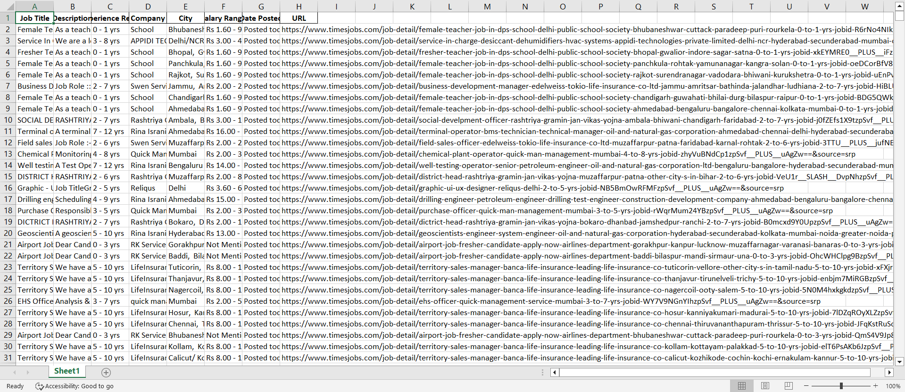

<a name="readme-top"></a>

[![Contributors][contributors-shield]][contributors-url]
[![Forks][forks-shield]][forks-url]
[![Stargazers][stars-shield]][stars-url]
[![Issues][issues-shield]][issues-url]
[![MIT License][license-shield]][license-url]
[![LinkedIn][linkedin-shield]][linkedin-url]

<!-- PROJECT LOGO -->
<br />
<div align="center">
  <a href="https://github.com/SAGAR-TAMANG/web-scraping-timesjobs">
    
  </a>

<h3 align="center">Web Scraping TimesJobs.com Using Selenium</h3>

  <p align="center">
    A simple Python Selenium-based code for web scraping TimesJobs.com.
    <br />
    <a href="https://github.com/SAGAR-TAMANG/web-scraping-timesjobs/README.md"><strong>Explore the docs »</strong></a>
    <br />
    <br />
    <a href="https://github.com/SAGAR-TAMANG/web-scraping-timesjobs/issues">Report Bug</a>
    ·
    <a href="https://github.com/SAGAR-TAMANG/web-scraping-timesjobs/issues">Request Feature</a>
  </p>
</div>

## Screenshots




<!-- TABLE OF CONTENTS -->
<details>
  <summary>Table of Contents</summary>
  <ol>
    <li>
      <a href="#about-the-project">About The Project</a>
      <ul>
        <li><a href="#built-with">Built With</a></li>
      </ul>
    </li>
    <li>
      <a href="#getting-started">Getting Started</a>
      <ul>
        <li><a href="#prerequisites">Prerequisites</a></li>
        <li><a href="#installation">Installation</a></li>
      </ul>
    </li>
    <li><a href="#usage">Usage</a></li>
    <li><a href="#roadmap">Roadmap</a></li>
    <li><a href="#contributing">Contributing</a></li>
    <li><a href="#license">License</a></li>
    <li><a href="#contact">Contact</a></li>
    <li><a href="#acknowledgments">Acknowledgments</a></li>
  </ol>
</details>

<!-- ABOUT THE PROJECT -->
## About The Project

[![Screenshot][product-screenshot]](#about-the-project)

This project aims to scrape job listings from TimesJobs.com using Selenium.

Contributions are welcome! Please see the [Contributing](#contributing) section to get started.

<p align="right">(<a href="#readme-top">back to top</a>)</p>

### Built With

* Python
* Selenium

<p align="right">(<a href="#readme-top">back to top</a>)</p>

<!-- GETTING STARTED -->
## Getting Started

To run this code locally, follow these steps.

### Prerequisites

* Python

### Installation

1. Clone the repo
    ```
    git clone https://github.com/SAGAR-TAMANG/web-scraping-timesjobs.git
    ```
2. Install requirements
    ```
    pip install -r requirements.txt
    ```

3. Start the script
    ```
    python main.py
    ```

<p align="right">(<a href="#readme-top">back to top</a>)</p>

<!-- ROADMAP -->
## Roadmap

- [x] Set up Selenium
- [x] Scrape job listings
- [x] Implement data storage
- [ ] Improve scraping efficiency

See the [open issues](https://github.com/SAGAR-TAMANG/web-scraping-timesjobs/issues) for a list of proposed features and known issues.

<p align="right">(<a href="#readme-top">back to top</a>)</p>

<!-- CONTRIBUTING -->
## Contributing

Contributions are welcome! Any contributions you make are **greatly appreciated**.

1. Fork the Project
2. Create your Feature Branch (`git checkout -b feature/AmazingFeature`)
3. Commit your Changes (`git commit -m 'Add some AmazingFeature'`)
4. Push to the Branch (`git push origin feature/AmazingFeature`)
5. Open a Pull Request

Don't forget to give the project a star! Thank you!

<p align="right">(<a href="#readme-top">back to top</a>)</p>

<!-- LICENSE -->
## License

Distributed under the MIT License. See `LICENSE` for more information.

<p align="right">(<a href="#readme-top">back to top</a>)</p>

<!-- CONTACT -->
## Contact

Sagar Tamang - [LinkedIn](https://www.linkedin.com/in/sagar-tmg/) - cs22bcagn033@kazirangauniversity.in

Project Link: [https://github.com/SAGAR-TAMANG/web-scraping-timesjobs](https://github.com/SAGAR-TAMANG/web-scraping-timesjobs)

<p align="right">(<a href="#readme-top">back to top</a>)</p>

<!-- ACKNOWLEDGMENTS -->
## Acknowledgments

* [ChatGPT](https://chat.openai.com/) for providing guidance.

<p align="right">(<a href="#readme-top">back to top</a>)</p>

<!-- MARKDOWN LINKS & IMAGES -->
<!-- https://www.markdownguide.org/basic-syntax/#reference-style-links -->
[contributors-shield]: https://img.shields.io/github/contributors/SAGAR-TAMANG/web-scraping-timesjobs.svg?style=for-the-badge
[contributors-url]: https://github.com/SAGAR-TAMANG/web-scraping-timesjobs/graphs/contributors
[forks-shield]: https://img.shields.io/github/forks/SAGAR-TAMANG/web-scraping-timesjobs.svg?style=for-the-badge
[forks-url]: https://github.com/SAGAR-TAMANG/web-scraping-timesjobs/network/members
[stars-shield]: https://img.shields.io/github/stars/SAGAR-TAMANG/web-scraping-timesjobs.svg?style=for-the-badge
[stars-url]: https://github.com/SAGAR-TAMANG/web-scraping-timesjobs/stargazers
[issues-shield]: https://img.shields.io/github/issues/SAGAR-TAMANG/web-scraping-timesjobs.svg?style=for-the-badge
[issues-url]: https://github.com/SAGAR-TAMANG/web-scraping-timesjobs/issues
[license-shield]: https://img.shields.io/github/license/SAGAR-TAMANG/web-scraping-timesjobs.svg?style=for-the-badge
[license-url]: https://github.com/SAGAR-TAMANG/web-scraping-timesjobs/LICENSE
[linkedin-shield]: https://img.shields.io/badge/-LinkedIn-black.svg?style=for-the-badge&logo=linkedin&colorB=555
[linkedin-url]: https://www.linkedin.com/in/sagar-tmg/
[product-screenshot]: img/screenshot.png
